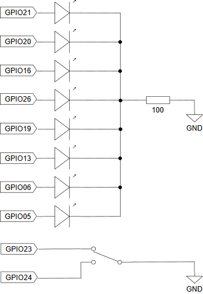

# led_device_driver
Device driver that can handle 8 LEDs on Raspberry Pi.

## Demo
* [led_device_driver demo - YouTube](https://youtu.be/C0My8v6srMk)

## Requirements
* Raspberry Pi 3 Model B
  * Raspbian
* Linux Kernel Source
  * download kernel source into `/usr/src/linux`
  * kernel build scripts : [https://github.com/ryuichiueda/raspberry_pi_kernel_build_scripts](https://github.com/ryuichiueda)
* 8 LEDs
* Resistor - 100[ohm]
* Single-Pole/Double-Throw Switch

## Installation
### Software
Download this repository.
```
git clone git@github.com:zaki0929/led_device_driver.git
```
### Hardware
Connect leds, resistor, switch to Raspberry Pi as shown in schematic.


## Usage
Move into led_device_driver directory and run a shell script.
```
cd led_device_driver
./myled.sh
```
